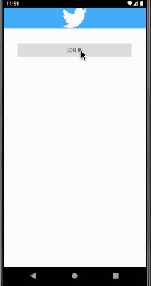

# Project 2 - SimpleTweet

SimpleTweet is an android app that allows a user to view their Twitter timeline. The app utilizes [Twitter REST API](https://dev.twitter.com/rest/public).

Time spent: 5 hours spent in total

## User Stories

The following **required** functionality is completed:

- [x] User can **sign in to Twitter** using OAuth login
- [x]	User can **view tweets from their home timeline**
  - [x] User is displayed the username, name, and body for each tweet
  - [x] User is displayed the [relative timestamp](https://gist.github.com/nesquena/f786232f5ef72f6e10a7) for each tweet "8m", "7h"
- [x] User can refresh tweets timeline by pulling down to refresh

The following **optional** features are implemented:

- [x] User can view more tweets as they scroll with infinite pagination
- [x] Improve the user interface and theme the app to feel "twitter branded"
- [x] Links in tweets are clickable and will launch the web browser
- [ ] User can tap a tweet to display a "detailed" view of that tweet
- [ ] User can see embedded image media within the tweet detail view
- [ ] User can watch embedded video within the tweet
- [ ] User can open the twitter app offline and see last loaded tweets
- [x] On the Twitter timeline, leverage the CoordinatorLayout to apply scrolling behavior that hides / shows the toolbar.

The following **additional** features are implemented:

- [ ] List anything else that you can get done to improve the app functionality!

## Video Walkthrough

Here's a walkthrough of implemented user stories:

GIF created with [LiceCap](http://www.cockos.com/licecap/).

## Notes

Ran into an error using my own Twitter API keys for some reason ("Error code 415: Callback URL not approved for this client application."), so I just ended up using the CodePath provided ones.

Also had an issue with making Android Studio recognize 'Tweet.java' as a Java class after I accidentally created it with a typo. Even after deleting the file & restarting the program several times, Android Studio wouldn't let me create a new file named Tweet with the error  "Unable to parse template "Class" Error message: Selected class file name 'Tweet.java' mapped to not java file type 'Auto-detect file type by content.' " I was able to resolve this by creating a file named something else, then renaming it 'Tweet', then going into a dialog accessible from the right-click menu that allowed me append '.java' to the file name and tell Android Studio to parse the file as a Java class.

Spent way too long trying to figure out how to get the account names, user names, and timestamps to wrap while also not overlapping each other; I ended up putting them into a LinearLayout within the RelativeLayout

## Open-source libraries used

- [Android Async HTTP](https://github.com/codepath/CPAsyncHttpClient) - Simple asynchronous HTTP requests with JSON parsing
- [Glide](https://github.com/bumptech/glide) - Image loading and caching library for Android

## License

    Copyright 2021 Ryan Johnson

    Licensed under the Apache License, Version 2.0 (the "License");
    you may not use this file except in compliance with the License.
    You may obtain a copy of the License at

        http://www.apache.org/licenses/LICENSE-2.0

    Unless required by applicable law or agreed to in writing, software
    distributed under the License is distributed on an "AS IS" BASIS,
    WITHOUT WARRANTIES OR CONDITIONS OF ANY KIND, either express or implied.
    See the License for the specific language governing permissions and
    limitations under the License.
